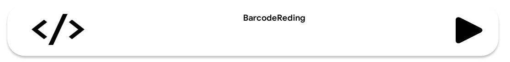
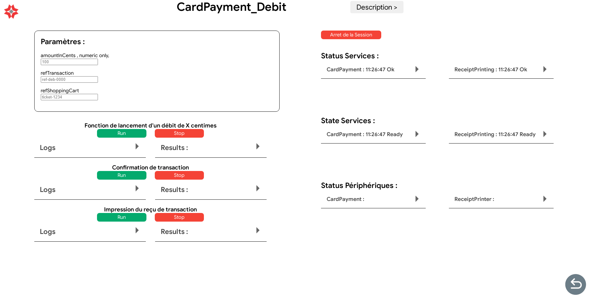
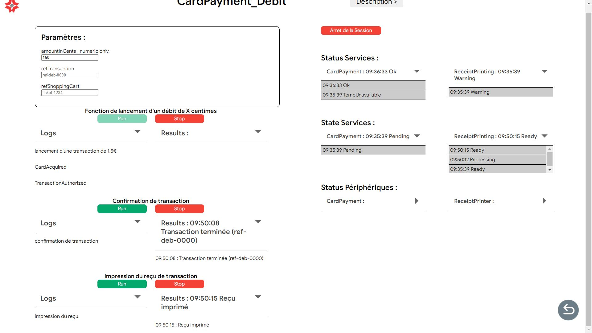

# DEMOSKV2

## Fonctionnalité

- [~] Choix du profil utilisateur
- [ ] Picker de scénario ( création de scénario à partir d'un picker de fonctionnalitées prédéfinies)
- [x] Portail vers les applications de démonstration
- [x] Page de lancement et de surveillance des tests / scénarios de fonctionnalités

### 1. Choix du profil utilisateur

**A faire :**
Il faut que l'utilisateur, lorsqu'il ouvre l'application puisse choisir un profil. Ce profil défini les manipulation qu'il pourra effectuer dans l'application.

Pour le moment il n'y a que l'interface du choix qui est fait. Il faut donc ajouter les fonctionnalités qui permettront de définir les actions de l'utilisateur en fonction du profil choisi.

---

### 2. Picker de scénario

**A faire :**
Le but de cette fonctionnalité est de permettre à l'utilisateur de choisir des fonctionnalités prédéfinies pour créer un scénario. Ce scénario pourra être lancé par l'utilisateur.

---

### Portail vers les applications de démonstration

Cette partie de l'application permet de lancer les applications de démonstration.

Lors de la création d'une nouvelle application de démonstration il faut :

1. Créer l'application dans le dossier `demos`

2. Créer les différentes routes internes à l'application

3. Importer les routes de l'application dans le fichier `app-routing.module.ts`

4. A chaque nouvelle application il faut rajouter un bouton dans le fichier`app-demo-choice.html`

   Exemple :

   ```html
   <div class="containerDemo nomDeApplication" routerLink="routingVersAppli">
     
     <div class="description">
       <h3>MoovHop - version EK4000</h3>
       <p>Application transports - version complète</p>
     </div>
     
   </div>
   ```

   - `routingVersAppli`: le routing vers l'application
   - `MoovHop - version EK4000`: le nom de l'application
   - `Application transports - version complète`: la description de l'application

   Résultat :
   

---

### Page de lancement et de surveillance des tests de fonctionnalités

Cette page permet de lancer les tests de fonctionnalités et de surveiller leurs évolution.

Pour ajouter un test il faut :

1. Créer deux fichiers : le premier un fichier `.json` qui contient les informations telles que le titre du test, la description, les périphériques et les services utilisés par le test. Le deuxième fichier est un fichier `.js` qui contient les méthodes de test. Ces deux fichiers ont le même nom (exemple : BarcodeReading.js et BarcordReading.json).

   - Le fichier JSON :

     - Il doit avoir pour squelette :

     ```json
     {
         "title": "nom du test",
         "description": "description du test",
         "serviceUsed": [
             {
                 "name": "nom du service"
             },
               ...
         ],
         "perifUsed": [
             {
                 "name": "nom du periphérique"
             },
             ...
         ]
     }
     ```

     - Exemple de fichier JSON :

     ```json
     {
       "title": "Lecture d'un code barre",
       "description": "Lecture d'un code barre",
       "serviceUsed": [
         {
           "name": "BarcodeReading"
         }
       ],
       "perifUsed": [
         {
           "name": "BarcodeScanner"
         }
       ]
     }
     ```

   - Le fichier JS :

     - Il doit contenir les méthodes suivantes :

       - `startn`: avec n le numéro du test. ces méthodes permet de lancer le test. Elles contiennent les ajouts d'eventListeners et les appels à l'API SoftKiosk.
       - `stopn`: avec n le numéro du test. Ces méthodes permettent d'arrêter les tests. Elles contiennent les suppressions d'eventListeners et les appels à l'API SoftKiosk.
       - Différentes fonctions qui contiennent le code du test.

     - Les logs de chaque fonctions doivent être construit de la manière suivant pour qu'ils soient traités par l'application :

       ```
       console.log("TYPE - Message");
       ```

       Avec les docnnées suivantes :

       - TYPE :

         - `START` : Pour indiquer le début du test.
         - `USER` : Pour indiquer une action de l'utilisateur.
         - `PREVIEW` : Pour afficher une donnée de prévisualisation (caméra, scanner).
         - `CAPTURE` : Pour indiquer la capture d'une information (caméra, scanner, lecteur QR Code ...).
         - `ERROR` : Pour indiquer une erreur donc la fin du script.
         - `END` : Pour indiquer la fin de l'action.

       - Le Message contient les informations que le dveloppeurs souhaite afficher. C'est la seul partie qui sera présente dans l'application.

     - Il doit contenir les différentes variables qui peuvent être modifié par l'utilisateur.

        ```javascript
        /**
         * @param {number} amountInCents - Default: 100 - Montant en centimes
        * @param {string} refTransaction - Default: ref-deb-0000 - Référence de la transaction
        * @param {string} refShoppingCart - Default: ticket-1234 - Référence du panier
        */
        ```

      - Il peut contenir des commentaires pour expliquer une fonction, cette description sera affiché au niveau des tests.

        ```javascript
        /**
         * Confirmation de transaction
        */
        function start1() {}
        ```

    - Exemple de fichier de test JavaScript :

        ```javascript
        /**
         * @title  LECTURE D'UN CODE BARRE
        * @description lecture d'un code barre
        */

        /**
        * lancement de la lecture de code barre
        */
        function start1() {
        console.log("START - Lancement de la lecture de code barre");
        Kiosk.BarcodeReading.addEventListener("barcodeRead", onBarcodeRead);
        Kiosk.BarcodeReading.readBarcode();
        }

        function onBarcodeRead(e) {
        switch (e.data.dataType) {
            case "BarcodeRead":
            console.log("CAPTURE - Code barre lu: " + e.data.barcode);
            Kiosk.BarcodeReading.removeEventListener("barcodeRead", onBarcodeRead);
            console.log("FIN - Arret de la lecture de code barre");
            break;
            default:
            break;
        }
        }

        function stop1() {
        console.log("FIN - Arret de la lecture de code barre");
        Kiosk.BarcodeReading.stopReadBarcode();
        Kiosk.BarcodeReading.removeEventListener("barcodeRead", onBarcodeRead);
        }
        ```

2. Ajouter le nom du scénario dans la liste _featuresList_ dans le fichier `app-demo-choice.html`

   ```javascript
   // Liste des features affiché dans le menu
   featuresList = ["Barcode_Reading", "Document_Scanning", "CardPayment_Debit", "Document_Printing"];
   ```

   Chaque élément de la liste va créer un bouton dans l'interface de l'application.

Exemple de bouton :


Interface résultat pour le test de paiement par carte bancaire:



Ci-dessous un exemple d'interface après le lancement d'un test :



Ci dessous les deux fichier qui ont permis de réaliser ce test:

- [CardPayment.js](../../assets/DemoSKV2/confTest/script/CardPayment_Debit.js)
- [CardPayment.json](../../assets/DemoSKV2/confTest/CardPayment_Debit.json)

---

## Maintenance de DemoSKV2

### Ajout d'un type de log

Pour ajouter un type de log il faut créer une condition dans la redéfintion du `console.log` dans le fichier `feature-run.component.ts` à la ligne 340.  
- **Ajout d'un log simple** : Le code ci-dessous est un exemple de condition pour un nouveau type de log . Le contenu du log est affiché dans une balise `<p>` dans la section Logs du test.

```typescript
    else if (logType == nouveauTypeDeLog) {
        var logElement = document.getElementById("panel_Logs_" + actualLogLocationLocal);
        logElement!.innerHTML += "<p>" + logContent.slice(0, 20) + "...</p>";
        _this.compteur = 0;
    }
}
```

- **Ajout d'un log de fin de test** : Le code ci-dessous est un exemple de condition pour un nouveau type de log . Le contenu du log est affiché dans une balise `<p>` dans la section Results du test.

```typescript
    else if (logType == nouveauTypeDeLog) {
        let hour = new Date();
        const heure = hour.getHours().toString().padStart(2, "0");
        const minutes = hour.getMinutes().toString().padStart(2, "0");
        const secondes = hour.getSeconds().toString().padStart(2, "0");
        const hourFormatted = `${heure}:${minutes}:${secondes}`;
        document.getElementById("panel_Logs_Results_" + actualLogLocationLocal)!.innerHTML += "<p>" +hourFormatted+ " : "+ logContent.slice(0, 20) + "...</p>";
        document.getElementById("playBtn_" + actualLogLocationLocal)!.style.opacity = "1";
        (document.getElementById("playBtn_" + actualLogLocationLocal) as HTMLButtonElement)!.disabled = false;
        _this.firstPreview = true;
        _this.isRunning = false;
    }
```

Avec `nouveauTypeDeLog` le nouveau type de log.


### 